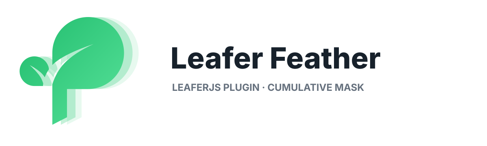

<p align="center">
  
</p>

# @choo/leafer-x-feather

LeaferJS 的非破坏性轮廓羽化滤镜。它通过 Leafer 原生 `Filter.register()` 扩展点工作，支持图片、纯色、渐变、描边、路径、容器、内外阴影和原生 JSON。

> **AI 辅助开发声明**
>
> 本项目在方案分析、代码实现、测试和文档整理过程中使用了 **OpenAI Codex** 作为 AI 辅助工具；最终代码与发布内容由项目维护者审核和负责。

GitHub 仓库：[gws890814/leafer-x-feather](https://github.com/gws890814/leafer-x-feather)

## 在线 Demo

**[打开 Leafer Feather 在线演示](https://gws890814.github.io/leafer-x-feather/)**

Demo 包含图片、渐变、描边、阴影、镂空路径、线条和自由路径，可实时调整单层或多层羽化半径，并查看对应的原生 Filter JSON。图片示例使用 [LeaferJS 官方图片](https://www.leaferjs.com/image/leafer.jpg)，构建时以同源静态资源发布，避免跨域 Canvas 污染。

## 特性

- 不修改源路径、图片、颜料或作者数据
- 羽化向轮廓内外连续过渡，内部图像细节保持清晰
- 一个 Filter 可保存多个羽化半径，并以透明度蒙版真实叠加
- 支持实时编辑、视口缩放、导出和 JSON 恢复
- 缓存按 Leafer 原生更新事件失效，平移和缩放不会重复计算内容
- 不依赖 Vue、Studio 编辑器或业务代码

## 安装

```bash
npm install @choo/leafer-x-feather @leafer-in/filter leafer-ui
```

也可以直接获取源码：

```bash
git clone https://github.com/gws890814/leafer-x-feather.git
```

包入口会自动注册滤镜，业务代码只需导入一次：

```ts
import '@choo/leafer-x-feather'
import { Rect } from 'leafer-ui'
import { createFeatherFilter } from '@choo/leafer-x-feather'

const rect = new Rect({
  width: 240,
  height: 160,
  fill: '#6c5ce7',
  filter: createFeatherFilter(24),
})
```

如需显式控制安装时机：

```ts
import { installFeather } from '@choo/leafer-x-feather'

installFeather() // 可重复调用
```

## 多层羽化

多层羽化使用一个 Filter 和一个半径数组：

```ts
node.filter = createFeatherFilter([24, 12, 6])

// 对应的原生 JSON
node.filter = {
  type: 'feather',
  radius: [24, 12, 6],
}
```

每个半径代表一层独立透明度蒙版。所有层共享最大半径的外扩范围，蒙版逐层相乘；半径不会简单相加，图像 RGB 也不会被重复模糊。

```ts
node.filter = createFeatherFilter([24, 0]) // 与 [24] 一致
node.filter = createFeatherFilter([24, 1]) // 保留 24px 外扩，仅轻微加强衰减
node.filter = createFeatherFilter([12, 12, 12]) // 轮廓透明度约 50% → 25% → 12.5%
```

调整或删除数组中的值会从原始内容重新计算，不会在旧像素上累积破坏。

为兼容旧数据，连续的多个 `{ type: 'feather' }` 滤镜对象也会合并为同一次蒙版计算；新项目建议始终使用半径数组。

## 原生 Filter 格式

`Filter.register()` 按 `type` 查找处理器，因此正确格式是：

```ts
{ type: 'feather', radius: 30 }
{ type: 'feather', radius: [30, 16, 8] }
```

`{ feather: 30 }` 不是 Leafer 原生 Filter 格式，本包不会对它做隐式转换。

## API

| API | 说明 |
| --- | --- |
| `createFeatherFilter(radius)` | 创建可直接赋给 `node.filter` 的滤镜对象 |
| `installFeather()` | 注册 `feather` 和旧版 `leafer-x-feather` 类型 |
| `normalizeFeatherRadius(value)` | 将半径限制在 `0...250` |
| `featherRadii(radius)` | 规范化数组并移除 0 半径 |
| `featherSpread(radius)` | 返回渲染所需的外扩边界 |
| `isFeatherFilter(value)` | 判断是否为当前或旧版 Feather Filter |
| `FEATHER_FILTER_TYPE` | 当前滤镜类型：`feather` |
| `MAX_FEATHER_RADIUS` | 默认最大半径：`250` |

半径使用 Leafer 文档单位，而不是固定屏幕像素。

## 渲染规则

1. 使用 Leafer 原生绘制路径生成颜色表面和几何覆盖率。
2. 以最大有效半径生成一次向外扩张的柔边。
3. 其余半径作为透明度蒙版继续衰减。
4. 用原始内容恢复内部 RGB 细节。
5. 在最终羽化透明度上计算 Leafer 原生内外阴影。

图片保留自身 alpha、裁剪和平铺；孔洞、容器裁剪、遮罩、渐变和描边均沿用 Leafer 的原生几何。实现不会通过像素阈值把半透明区域强制变成不透明。

## 性能与缓存

滤镜在组件自身坐标中缓存渲染表面：

- 平移和普通视口缩放复用缓存
- 路径、尺寸、颜料、滤镜、阴影、子元素或图片加载变化会失效缓存
- 导出像素密度变化时重新生成对应结果
- 位图尺寸遵循 `Platform.image.maxCacheSize`
- 缓存由弱引用持有，不进入 JSON

首次生成和内容变更需要重新计算。非常大的半径、超大节点或大量同时羽化的容器仍会增加 Canvas 内存和渲染成本。

## 兼容性

- LeaferJS：`>= 2.2.9 < 3`
- 运行环境：支持 Canvas 2D 的现代浏览器
- 模块：ESM、CommonJS、IIFE
- 旧滤镜类型 `leafer-x-feather` 会自动映射到当前处理器

IIFE 产物为 `dist/feather.global.js`，要求页面先提供 Leafer 的全局运行时 `LeaferUI`。

## Demo 与开发

```bash
npm install
npm run dev
```

打开 `http://127.0.0.1:4186/`。Demo 可调整任意一层半径、添加/删除羽化层、切换预设，并实时查看最终 Filter JSON。线上版本见 [GitHub Pages Demo](https://gws890814.github.io/leafer-x-feather/)。

构建静态 Demo：

```bash
npm run build:demo
npm run preview:demo
```

仓库的 `main` 分支更新后，GitHub Actions 会自动构建并部署到 GitHub Pages。

```bash
npm run check
```

`check` 会执行类型检查、清理并构建发布产物，然后运行单元测试。浏览器像素回归代码保留在 `demo/regression.ts`，不进入公开 Demo 的生产构建。

## 目录

```text
src/
  types.ts      公共数据模型与规范化
  install.ts    Leafer Filter 注册器
  render.ts     羽化表面、叠加和效果合成
  selection.ts  原生几何覆盖率绘制
  cache.ts      更新事件与缓存版本
demo/           独立交互演示和浏览器回归
tests/          Node 单元测试与包边界检查
```

## 许可证

[MIT](./LICENSE)
